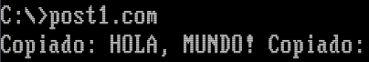
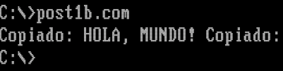
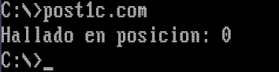
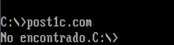
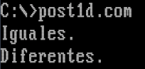

# Unidad 8 - Post-Contenido 1: Operaciones con Cadenas y Aritmética

**Arquitectura de Computadores**  
Ingenieria de Sistemas - Universidad Francisco de Paula Santander  
2026

---

## Descripcion

Este laboratorio implementa en NASM bajo DOSBox un programa que utiliza las instrucciones de procesamiento de cadenas `REP MOVSB`, `REP MOVSW`, `REPNE SCASB` y `REPE CMPSB` para copiar bloques de memoria, buscar caracteres en cadenas y comparar cadenas. Se verifica el comportamiento de los registros SI, DI, CX y el flag DF en cada operacion.

---

## Requisitos

- DOSBox 0.74 o superior con NASM disponible en el entorno.
- Editor de texto plano para escribir el codigo fuente `.asm`.
- Conocimientos previos: estructura de un programa NASM `.com` (ORG 100h), uso de INT 21h/AH=09h para imprimir cadenas terminadas en `$`, concepto de segmentos DS y ES en modo real.

---

## Estructura del repositorio

```
ardila-post1-u8/
├── post1.asm        # Checkpoint 1: copia con REP MOVSB
├── post1b.asm       # Checkpoint 2: copia optimizada con REP MOVSW
├── post1c.asm       # Checkpoint 3: busqueda con REPNE SCASB
├── post1d.asm       # Checkpoint 4: comparacion con REPE CMPSB
├── capturas/        # Capturas de pantalla de la ejecucion en DOSBox
└── README.md
```

---

## Compilacion y ejecucion

Dentro de DOSBox, con NASM disponible en el PATH:

```
nasm -f bin post1.asm -o post1.com
post1.com
```

Repetir sustituyendo `post1` por `post1b`, `post1c` o `post1d` segun corresponda.

---

## Programas y checkpoints

### Checkpoint 1 - post1.com: Copia de cadena con REP MOVSB

Copia 13 bytes de la cadena `"HOLA, MUNDO!"` desde el buffer `origen` hacia el buffer `destino` usando `REP MOVSB`. Antes de la operacion se carga ES con el valor de DS (requisito en programas `.com` donde ambos segmentos son el mismo), se configura SI apuntando al origen, DI al destino, CX con la cantidad de bytes a copiar, y se ejecuta `CLD` para asegurar que DF=0 (direccion ascendente). Al finalizar, el programa imprime el contenido del buffer destino con INT 21h/AH=09h.



---

### Checkpoint 2 - post1b.com: Copia optimizada con REP MOVSW

Variante optimizada del checkpoint anterior que copia 2 bytes por iteracion usando `REP MOVSW`. Para una longitud de 13 bytes (impar), se divide CX entre 2 con `SHR CX,1` para obtener 6 words (12 bytes), se copian con `REP MOVSW`, y luego se verifica con `AND AX,1` si queda un byte sobrante; de ser asi, un `MOVSB` adicional copia el ultimo byte. El resultado en pantalla es identico al del Checkpoint 1.



---

### Checkpoint 3 - post1c.com: Busqueda de caracter con REPNE SCASB

Busca un caracter dentro de la cadena `"Arquitectura de Computadores"` usando `REPNE SCASB`. La instruccion compara AL con `[ES:DI]` en cada iteracion, avanzando DI mientras no haya coincidencia (ZF=0) y CX > 0. Al terminar, si ZF=1 la busqueda fue exitosa y la posicion base-0 se calcula como `DI - inicio - 1`. Si ZF=0 al agotar CX, se muestra "No encontrado."

- Con entrada `"A"`: el caracter se halla en la posicion 0 (indice base-0).
- Con entrada `"ñ"`: el caracter no existe en la cadena y el programa muestra "No encontrado."




---

### Checkpoint 4 - post1d.com: Comparacion de cadenas con REPE CMPSB

Compara cadenas byte a byte usando `REPE CMPSB`, que avanza SI y DI mientras los bytes sean iguales (ZF=1) y CX > 0. Se realizan dos comparaciones:

- `cad1` (`"NASM x86"`) vs `cad2` (`"NASM x86"`): cadenas identicas, ZF=1 al terminar → imprime "Iguales."
- `cad1` (`"NASM x86"`) vs `cad3` (`"NASM ARM"`): la instruccion se detiene en el quinto caracter (donde `"x"` difiere de `"A"`), ZF=0 → imprime "Diferentes."



---

## Resumen de instrucciones de cadena utilizadas

| Instruccion   | Prefijo | Condicion de parada adicional | Accion por iteracion          |
|---------------|---------|-------------------------------|-------------------------------|
| MOVSB / MOVSW | REP     | CX = 0                        | Copia byte/word DS:SI a ES:DI, avanza SI y DI |
| SCASB         | REPNE   | ZF = 1 o CX = 0              | Compara AL con ES:DI, avanza DI               |
| CMPSB         | REPE    | ZF = 0 o CX = 0              | Compara DS:SI con ES:DI, avanza SI y DI       |

El flag DF controla la direccion de avance de los punteros: `CLD` (DF=0) avanza de menor a mayor direccion; `STD` (DF=1) avanza en sentido inverso. En todos los programas de este laboratorio se usa `CLD`.

---

## Autor

Diego Ardila  
Ingenieria de Sistemas - UFPS  
2026